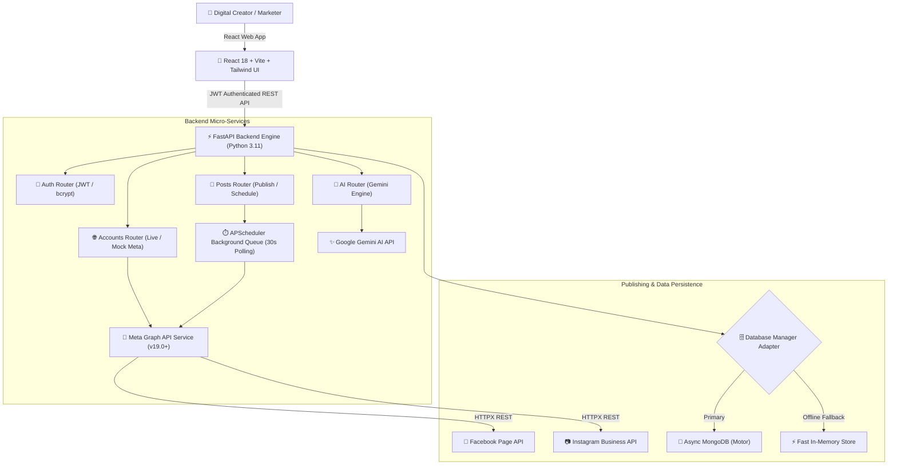

# 🚀 PostPulse — AI Social Media Scheduler & Meta Auto-Publisher

[](https://fastapi.tiangolo.com/)
[](https://reactjs.org/)
[](https://vitejs.dev/)
[](https://tailwindcss.com/)
[](https://ai.google.dev/)
[](https://developers.facebook.com/)
[](LICENSE)

> **PostPulse** is an enterprise-grade, multi-account social media management and publishing platform built with **FastAPI**, **MongoDB / Motor**, **APScheduler**, **Google Gemini AI**, and **React**. It empowers digital creators, marketing agency teams, and enterprise brands to generate high-converting social media copy, schedule posts across interactive visual calendars, and automatically publish across **Meta APIs (Facebook Pages & Instagram Business Profiles)**.

---

## 🌟 Key Features & System Capabilities

### 🤖 AI Content Studio (Google Gemini Engine)
- **Multi-Tone Copywriting**: Instantly generate social copy in 6 distinct brand voices (*Professional*, *Casual*, *Punchy*, *Viral Hook*, *Educational*, *High-Converting Sales*).
- **Cross-Platform Adaptations**: Generates tailored post variants optimized for **Facebook long-form feed posts** vs. **Instagram visual-first captions**.
- **Hashtag Clustering**: Automatic extraction and creation of high-reach hashtag clusters.
- **AI Image Prompt Generator**: Recommends visual prompts for AI art generators (Midjourney, DALL-E 3, Stable Diffusion).

### 🌐 Meta Graph API Auto-Publisher (v19.0+)
- **Facebook Page Graph API**: Direct publishing of text feed posts, photo posts, and link previews.
- **Instagram Business Graph API**: Two-phase media container creation (`/media`) and publishing (`/media_publish`) workflow.
- **Dual-Engine Architecture**: Supports **Live Meta Tokens** (`EAA...`) with live profile metadata auto-verification, alongside a zero-config **Mock Sandbox Engine** for evaluation without developer app credentials.

### ⏱️ Async Background Task Scheduler (APScheduler)
- **Precision Time Queueing**: Polling queue engine that checks scheduled posts every 30 seconds and triggers publication upon time arrival.
- **Resilient Retry & Error Handling**: Captures Meta API response payloads, updates post state (`Draft`, `Scheduled`, `Publishing`, `Published`, `Failed`), and stores detailed error diagnostic logs.

### 📊 Multi-Account Hub & Analytics Dashboard
- **Unified Account Management**: Connect multiple Facebook Pages & Instagram Profiles with active sync status tracking.
- **Visual Analytics**: Interactive velocity charts, platform distribution breakdown (Recharts), and status counters.
- **Interactive Calendar**: Weekly & monthly grid view with drag-and-drop scheduling readiness.

---

## 🏛️ System Architecture



---

## 🛠️ Tech Stack & Technologies

| Layer | Technology | Description |
| :--- | :--- | :--- |
| **Frontend** | React 18, Vite 5, Tailwind CSS | High-performance SPA with glassmorphic dark design system |
| **Icons & UI** | Lucide React, Recharts, Axios | Modern iconography, data visualization & HTTP client |
| **Backend** | Python 3.11+, FastAPI, Uvicorn | Asynchronous Python ASGI web server |
| **Task Queue** | APScheduler 3.10 | Asynchronous background polling and cron job executor |
| **AI Engine** | Google Generative AI SDK | `google-generativeai` (Gemini Pro/Flash integration) |
| **Meta API** | Meta Graph API v19.0+ | Direct HTTPX client integration for Facebook & Instagram |
| **Database** | Motor / PyMongo | Dual-mode MongoDB driver with built-in zero-setup in-memory fallback |
| **Security** | PyJWT, bcrypt, Passlib | JWT Bearer token authentication & password hashing |

---

## ⚡ Quick Start Guide (Local Development)

### Prerequisites
- **Node.js**: v18.0 or higher
- **Python**: v3.10 or higher
- *(Optional)* **MongoDB**: Running locally at `mongodb://localhost:27017` (If omitted, PostPulse automatically uses the built-in fast In-Memory Store).

---

### 1. Clone & Set Up Backend

```bash
# Navigate to backend directory
cd backend

# Create & activate Python virtual environment
python -m venv .venv

# On Windows (PowerShell):
.\.venv\Scripts\activate
# On macOS/Linux:
source .venv/bin/activate

# Install backend dependencies
pip install -r requirements.txt

# Start FastAPI development server
uvicorn app.main:app --reload --port 8000
```
- **API Documentation (Swagger UI)**: Open [http://localhost:8000/docs](http://localhost:8000/docs)

---

### 2. Set Up Frontend

Open a new terminal tab:

```bash
# Navigate to frontend directory
cd frontend

# Install Node modules
npm install

# Start Vite dev server
npm run dev
```
- **Web Application Preview**: Open [http://localhost:3000](http://localhost:3000)

---

## 🔑 Environment Variables Configuration

Create a `.env` file in the `backend/` directory:

```env
# Security & JWT Token Key
JWT_SECRET=super-secret-postpulse-jwt-key-2026

# Database Connection (Leave default or connect MongoDB Atlas)
MONGODB_URL=mongodb://localhost:27017
DATABASE_NAME=postpulse_db

# Google Gemini AI Key (Optional - Fallback engine active if omitted)
GEMINI_API_KEY=your_gemini_api_key_here

# Meta Graph API Credentials (Optional - Default Sandbox Mock active if omitted)
META_APP_ID=your_meta_app_id
META_APP_SECRET=your_meta_app_secret
META_API_VERSION=v19.0

# Set to 'true' for local sandbox testing without approved Meta developer app
USE_MOCK_META=true
```

---

## 🌐 Production Deployment Guide

PostPulse is pre-configured for instant deployment on **Vercel** (Frontend) and **Render** / **Railway** / **Docker** (Backend).

### Step 1: Deploy Backend (Render or Railway)
1. Push repository to **GitHub**.
2. Create a **New Web Service** on [Render.com](https://render.com) pointing to the `backend` directory.
3. Configure settings:
   - **Build Command**: `pip install -r requirements.txt`
   - **Start Command**: `uvicorn app.main:app --host 0.0.0.0 --port $PORT`
4. Set Environment Variables (`JWT_SECRET`, `USE_MOCK_META=true`).
5. Copy your live backend URL (e.g. `https://postpulse-backend.onrender.com`).

### Step 2: Deploy Frontend (Vercel)
1. Create a **New Project** on [Vercel.com](https://vercel.com) pointing to the `frontend` directory.
2. Select **Vite** framework preset.
3. Add Environment Variable:
   - `VITE_API_BASE_URL`: `https://postpulse-backend.onrender.com`
4. Deploy!

*(For full step-by-step deployment instructions, refer to [DEPLOYMENT.md](DEPLOYMENT.md))*

---

## 👨‍💻 Quick Evaluator Demo Access

For zero-friction evaluator testing:
1. Launch the web app at `http://localhost:3000`.
2. Click **"Quick 1-Click Evaluator Demo Access"** on the login page.
3. **Demo Credentials**:
   - **Email**: `developer@postpulse.ai`
   - **Password**: `demo1234`

---

## 📜 License

Distributed under the MIT License. See `LICENSE` for details.
